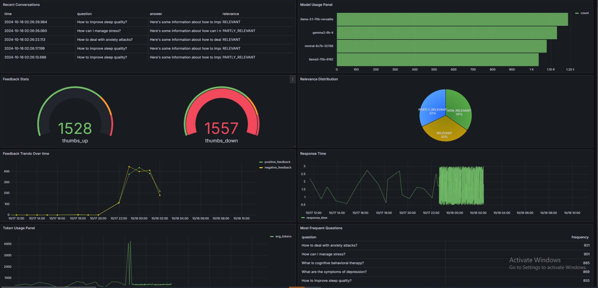

## Project Overview: Mental Health Assistant RAG
This project, Mental Health Assistant RAG, was developed to support individuals with mental health concerns by implementing a Retrieval-Augmented Generation (RAG) system. The assistant intelligently answers mental health-related queries by integrating a knowledge base and large language models (LLMs). The system is designed to assist with questions about issues such as depression, trauma, stress, grief, and relationships. By leveraging retrieval and generation capabilities, this project offers users accurate, supportive, and personalized responses, making it a valuable tool for mental health guidance and education.

## 🧠 Problem Description
Mental health is a crucial aspect of well-being, affecting millions of people worldwide. However, individuals seeking guidance often face challenges in finding trustworthy, relevant, and personalized information quickly. The complexity and sensitivity of mental health issues, coupled with the vast amount of available resources, make it difficult for people to get timely, accurate advice.

This project aims to address these challenges by developing an intelligent mental health assistant that can handle complex queries and provide contextually relevant and accurate answers. By leveraging RAG techniques, the system combines the reasoning power of LLMs with the precision of curated mental health knowledge, ensuring that users receive personalized support and guidance based on expert sources. This assistant makes mental health resources more accessible and helps reduce the stigma associated with seeking help, offering a bridge between individuals and the mental health care they need.

### **🧬 Technologies and Tools Used**

#### ⚗️ Key Technologies
- **Docker**: Containerizes the application to ensure seamless deployment and consistent execution across various environments, making it easier to manage dependencies and configurations.
- **Grafana**: Provides real-time monitoring and visualization dashboards to track application performance, user interactions, and usage metrics, supporting continuous improvement.
- **Streamlit**: Offers a simple, interactive user interface that allows users to engage with the Mental Health Assistant and ask mental health-related questions.
- **PostgreSQL**: Serves as the relational database for storing user questions, responses, and feedback, ensuring data consistency and scalability.

#### 🧬 LLMs Used
- **gemma2-9b-it**: Used to reformulate user questions, optimizing them for better clarity and understanding by the assistant.
- **llama3-70b-8192**: Powers the retrieval-augmented generation process by handling complex mental health queries and delivering accurate, contextually relevant responses.
- **mixtral-8x7b-32768**: Contributes to processing large volumes of text, refining responses for depth and relevance.
- **Groq**: Integrated into the system to enhance vector processing efficiency during the search and retrieval phase, improving response time.
- **MinSearch**: Provides fast, scalable retrieval of information by managing vector indexing and semantic search, enabling more precise query-to-answer matching.

#### ⚗️ Other Tools Used for Development
- **Pytest**: Used for unit and integration testing to ensure the reliability and robustness of the code.
- **Git**: Version control system for tracking project changes, enabling collaboration, and maintaining code integrity.
- **Visual Studio Code**: IDE used for coding, debugging, and managing the development workflow.
- **Jupyter Notebook**: Utilized for exploratory data analysis, prototyping, and preprocessing, offering an interactive platform for data exploration.

### **🧬 Dataset**
The dataset in this project contains information related to **mental health queries**, structured for use in the knowledge base of the Retrieval-Augmented Generation (RAG) system. The data is stored in the [dataset](dataset/data.csv) directory and serves as the foundation for generating mental health-related responses in areas such as depression, trauma, stress, and relationship issues.

---

### **Backend Files Overview**

The backend of the **Mental Health Assistant** application handles various components of the RAG system, including data ingestion, retrieval, and interaction with the Large Language Models (LLMs). Below is an overview of the key backend files:

#### **1. [app.py](src/app.py)**
- Streamlit app that Processes the user queries by retrieving relevant data from the knowledge base and generating a response using the LLM and gets the user feedback on the responses provided by the assistant to continuously improve the system.


#### **2. [rag.py](src/rag.py)**
- **Core RAG Logic**: Implements the primary logic for the Retrieval-Augmented Generation process.
- **Key Functions**:
  - **Query Minsearch**: Searches for relevant mental health-related documents in the Minsearch knowledge base.
  - **Build Prompts**: Constructs the input prompt for the LLM based on the retrieved documents.
  - **Evaluate Answers**: Assesses the relevance of the AI-generated answers to ensure they are contextually accurate and meaningful.

#### **3. [db.py](src/db.py)**
- **Database Management**: Manages interaction with the **PostgreSQL** database.
- **Key Features**:
  - **Initialize Database Schema**: Creates the necessary database tables to store conversations and user feedback.
  - **Save Conversations**: Stores question-answer pairs and feedback to analyze user interactions over time.


#### **5. [ingest.py](src/ingest.py)**
- **Document Ingestion**: Handles theingestion of the dataset into Minsearch.
- **Key Features**:
  - **Text Cleaning**: Pre-processes and cleans mental health-related documents before indexing.
  - **Document Indexing**: Pushes the cleaned documents into Elasticsearch for later retrieval during RAG queries.


#### **6. init.py**
- **Grafana Setup**: Configures **Grafana** for monitoring the system's performance.
- **Key Features**:
  - **Data Source Configuration**: Sets up PostgreSQL as a data source for tracking system metrics such as query response times, user activity, and feedback analysis.
  - **Dashboard Initialization**: Initializes Grafana dashboards for visualizing key metrics like query efficiency, response accuracy, and feedback trends.

### **6. [Dockerfile](Dockerfile)**
- **Base Image** : Uses python:3.12-slim as the base image for a lightweight container.
- **Working Directory** : Sets the working directory to /app.**
- **Pipenv Installation** : Installs pipenv to manage dependencies.
- **Data and Dependency Copying** : Copies the dataset and dependency files into the container.
- **Streamlit Launch**: Specifies the command to run the Streamlit app on port 8501.

### **7. [docker-Compose.yaml](docker-compose.yaml)**
- **Service Definitions**: Sets up three services: PostgreSQL, Streamlit, and Grafana.
- **PostgreSQL Configuration**: Defines environment variables for the database setup.
- **Streamlit Configuration**: Builds the Streamlit service using the Dockerfile, specifying dependencies and environment variables.
- **Grafana Configuration**: Sets up Grafana with the necessary environment variables and dependencies.

---

This backend architecture supports the Mental Health Assistant application by efficiently processing user queries, generating contextually relevant mental health responses, and providing insightful metrics for system performance monitoring.

### **Running the Mental Health Assistant Application**

This guide outlines how to run the **Mental Health Assistant** application, configure the database, and interact with the system using Docker, Docker Compose, and local environments.

---

### **Database Configuration**

Before starting the application for the first time, the PostgreSQL database needs to be initialized.

#### **Step 1: Start PostgreSQL**

To run PostgreSQL using Docker Compose, execute the following command:

```bash
docker-compose up postgres
```

#### **Step 2: Initialize the Database**

After PostgreSQL is running, initialize the database schema by running the `db_prep.py` script:

```bash
pipenv shell

cd mental_health_assistant

export POSTGRES_HOST=localhost
python run app.py
```

#### **Step 3: Verify Database Content**

To inspect the contents of the database, you can use `pgcli`, which is installed through `pipenv`. Access the PostgreSQL instance with the following command:

```bash
pipenv run pgcli -h localhost -U your_username -d mental_health_assistant -W
```

Once inside `pgcli`, you can view the schema with the `\d` command:

```sql
\d conversations;
```

To select and display data from the `conversations` table:

```sql
SELECT * FROM conversations;
```

---

### **Running the Application with Docker Compose**

The easiest way to run the application is by using Docker Compose. This command will bring up the services defined in the `docker-compose.yaml` file, including PostgreSQL, Grafana, and the Streamlit application:

```bash
docker-compose up
```

---

### **Running the Application Locally**

If you want to run the application locally without Dockerizing the entire environment, you can start only the PostgreSQL and Grafana services using Docker Compose:

```bash
docker-compose up postgres grafana
```

If you previously started all services using `docker-compose up`, stop the Streamlit application before proceeding:

```bash
docker-compose stop streamlit
```

Now, you can run the application on your host machine:

```bash
pipenv shell

cd mental_health_assistant

export POSTGRES_HOST=localhost
python app.py
```

---

### **Running the Application with Docker (without Docker Compose)**

You may want to run the application in Docker without Docker Compose, especially for debugging or development purposes.

#### **Step 1: Prepare the Environment**

Before running the application standalone in Docker, ensure the environment is properly set up by running Docker Compose as explained above.

#### **Step 2: Build the Docker Image**

To build the Docker image manually, run the following command:

```bash
docker build -t mental-health-assistant .
```

#### **Step 3: Run the Docker Container**

To run the application in a Docker container without using Docker Compose, use this command:

```bash
docker run -it --rm \
    --network="mental_health_assistant_default" \
    --env-file=".env" \
    -e GROQ_API_KEY=${GROQ_API_KEY} \
    -e DATA_PATH="dataset/data.csv" \
    -p 8501:8501 \
    mental-health-assistant
```

This will run the container, exposing the Streamlit application on port `8501`.

---


## Experiments
For experiments, we use Jupyter notebooks. They are in the notebooks folder.

To start Jupyter, run:
```
cd notebooks
pipenv run jupyter notebook
```
We have the following notebooks:

**[data-generation.ipynb](notebooks/data_generation.ipynb)**: Generating the ground truth dataset for retrieval evaluation.
**[rag-test.ipynb](notebooks/rag_evaluation.ipynb)**: The RAG flow and evaluating the system.

### **Retrieval Evaluation**

Retrieval performance is critical in ensuring that the Mental Health Assistant provides accurate and relevant answers to user queries. The evaluation was carried out using two versions of our retrieval system: the basic version (without boosting) and the improved version (with tuned boosting parameters).

#### **1. Basic Version: MinSearch without Boosting**

The initial retrieval system, without any additional boosting mechanisms, yielded the following results:

- **Hit Rate**: 92%  
  The hit rate measures the proportion of user queries that successfully retrieve at least one relevant document from the knowledge base. A 92% hit rate means that 92 out of every 100 queries returned relevant results.
  
- **MRR (Mean Reciprocal Rank)**: 71%  
  The MRR measures the effectiveness of the retrieval system by calculating the average of the reciprocal ranks of the relevant documents retrieved. In this case, the MRR of 71% indicates that relevant documents are generally ranked well but with some room for improvement.

#### **2. Improved Version: Tuned Boosting**

By adjusting the boosting parameters, the retrieval performance improved significantly. Boosting helps prioritize more relevant results by increasing the weight of important features (e.g., giving more emphasis to certain keywords in queries or documents).

- **Hit Rate**: 97%  
  The hit rate increased to 97%, demonstrating a much higher likelihood of retrieving relevant results for user queries.

- **MRR**: 72%  
  A slight improvement in the MRR shows that the tuned system ranks relevant results marginally better than the basic version.

#### **Best Boosting Parameters**

The best performance was achieved with the following boosting configuration:
- **Boost Parameters**:
  - `questions`: 1.0
  - `answers`: 1.0
  - `num_results`: 20

This provided a balanced approach by equally boosting the significance of both questions and answers, and by returning up to 20 results for each query, ensuring more diverse retrieval options.

---

### **RAG Flow Evaluation**

In addition to retrieval performance, the entire Retrieval-Augmented Generation (RAG) flow was evaluated. This flow combines retrieved documents with a Large Language Model (LLM) to generate relevant responses to user queries.

#### **LLM-as-a-Judge Metric**

We used the **LLM-as-a-Judge** metric to evaluate the relevance of the answers generated by the RAG system. This metric involves having the LLM assess its own responses, classifying them into three categories:
1. **RELEVANT**: The response fully answers the query based on the retrieved documents.
2. **PARTLY_RELEVANT**: The response partially addresses the query but lacks full relevance.
3. **NON_RELEVANT**: The response is not relevant to the query.

For this evaluation, we used the **Mixtral-8x7b-32768** model, a powerful language model optimized for understanding and generating natural language.

#### **Results for Mixtral-8x7b-32768**

- **348 RELEVANT**  
  The vast majority of responses generated by the RAG system were classified as fully relevant, meaning they accurately addressed the user queries.

- **17  PARTLY_RELEVANT**  
  A small percentage of the responses were only partially relevant, indicating that the system could still improve its handling of some queries or edge cases.

- **1 NON_RELEVANT**  
  Only one response was deemed non-relevant, showing that the system is highly reliable in producing useful responses.

The following chart illustrates the distribution of the relevance categories for the responses generated by the Mixtral-8x7b-32768 model:


#### **Results for LLama**

For comparison, we also tested the system using the Llama LLM, which produced the following results:

**317 RELEVANT**
This model generated relevant responses for most user queries.

**31 NON_RELEVANT**
A higher rate of irrelevant responses compared to the Mixtral model, indicating that this model is more prone to generating inappropriate answers.

**18 PARTLY_RELEVANT**
Some responses were only partially relevant to the query.

The following chart illustrates the distribution of the relevance categories for the responses generated by the Llama model:


### Monitoring
We use Grafana for monitoring the application.All Grafana configurations are in the [grafana folder](grafana):

* [init.py](grafana/init.py) - for initializing the datasource and the dashboard.
* [dashboard.json](grafana/dashboard.json) - the actual dashboard (taken from LLM Zoomcamp without changes).
To initialize the dashboard, first ensure Grafana is running (it starts automatically when you do docker-compose up).
Then run:
```
pipenv shell
cd grafana
env | grep POSTGRES_HOST
python init.py

```
Access Grafana at [localhost:3000](http://localhost:3000/) with the default credentials (admin/admin).

The monitoring dashboard contains several panels:

1. Last 5 Conversations (Table): Displays a table showing the five most recent conversations, including details such as the question, answer, relevance, and timestamp. This panel helps monitor recent interactions with users.
2. +1/-1 (Pie Chart): A pie chart that visualizes the feedback from users, showing the count of positive (thumbs up) and negative (thumbs down) feedback received. This panel helps track user satisfaction.
3. Relevancy (Gauge): A gauge chart representing the relevance of the responses provided during conversations. The chart categorizes relevance and indicates thresholds using different colors to highlight varying levels of response quality.
4. Model Used (Bar Chart): A bar chart displaying the count of conversations based on the different models used. This panel provides insights into which AI models are most frequently used.
5. Response Time (Time Series): A time series chart showing the response time of conversations over time. This panel is useful for identifying performance issues and ensuring the system's responsiveness.
